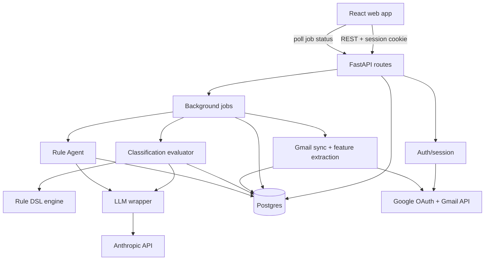

# Architecture

## System overview

## Layering rules

- **`routes/*` are thin.** They authenticate the user (`core/deps.get_current_user`),
  parse/validate input, call into `gmail/`, `classify/`, or `agent/`, and shape the
  response. No business logic lives in a route handler.
- **`core/dsl.py` is I/O-free.** It defines the rule condition types and a pure
  `evaluate(rule, features) -> bool`. It has no DB import and is shared by
  `classify/rules_engine.py`, `agent/rule_agent.py`'s validator, and (serialized to JSON)
  the frontend's `RuleSection.tsx` / `ruleFormat.ts`.
- **`gmail/thread_features.py` is the only place message→thread aggregation happens.**
  Everything downstream — the rules engine, the semantic evaluator, the agent tools —
  consumes the resulting flat feature dict (`threads.features` JSONB), never raw Gmail
  message payloads.
- **`rules_engine.evaluate_bucket()` and `semantic_eval.evaluate_many()` implement the
  same interface** at the bucket level, so `classify/evaluator.py` can dispatch on a
  bucket's `mode` column instead of branching business logic.
- **`core/llm.py` is the only place `anthropic.AsyncAnthropic` is called directly.** It
  centralizes prompt-cache structure, JSON-parse retry, and (rate-limit/overload) retry
  with backoff, so every caller — sync classification, the semantic evaluator, the rule
  agent, digests — gets the same failure handling for free.
- **`core/queue.py` is the one real portability seam.** It's an in-process asyncio queue
  today; the interface (`enqueue`/`get`/`push_progress`) is designed to be swapped for an
  SQS-backed adapter without changing any caller.

## Request/response shape

- Auth: Google OAuth 2.0 authorization-code flow, refresh token encrypted at rest
  (`core/crypto.py`, Fernet), session identity carried in an httpOnly JWT cookie
  (`core/session.py`) — no tokens ever touch the frontend.
- Long-running work (Gmail sync, bucket creation → rule agent run, semantic
  classification) is enqueued as a background job (`core/queue.py`) and the frontend polls
  `GET /jobs/{id}` (see `api.ts:pollJob`) — no websockets are needed for this workload.
- The DB is Postgres, accessed exclusively through async SQLAlchemy (`core/db.py`),
  migrated with Alembic (`api/migrations/versions/*`).

## Known console noise (not bugs)

Opening a thread renders the real email HTML in a sandboxed iframe
(`EmailBody.tsx`), sanitized server-side but otherwise unmodified. Two DevTools
messages are expected there and don't indicate an app bug:

- `Blocked script execution in 'about:srcdoc'...` — the iframe's `sandbox`
  attribute intentionally omits `allow-scripts`, so any script an email
  attempts to run gets blocked. This is the sandbox working as intended;
  adding `allow-scripts` to silence it would open an XSS hole (arbitrary
  sender-controlled JS running in the app). Emitted by the browser's security
  layer directly to DevTools — not something app code can catch or suppress.
- `net::ERR_BLOCKED_BY_CLIENT` on third-party URLs (e.g. marketing tracking
  pixels/redirect links embedded in the email body) — the user's own ad
  blocker refusing those requests at the network layer. Not a `fetch()` call
  our code makes, and not observable via `window.onerror` or any JS handler.

## Local deployment

`docker-compose.yml` runs Postgres + the FastAPI app; the frontend is a separate Vite dev
server (or a static build) that talks to the API over `VITE_API_BASE`. The intended cloud
target is Postgres → RDS, the API container → ECS Fargate, and
`core/queue.py`'s local adapter → SQS, with no other technology swap — the local and cloud
stacks are meant to stay identical everywhere except those two seams.
