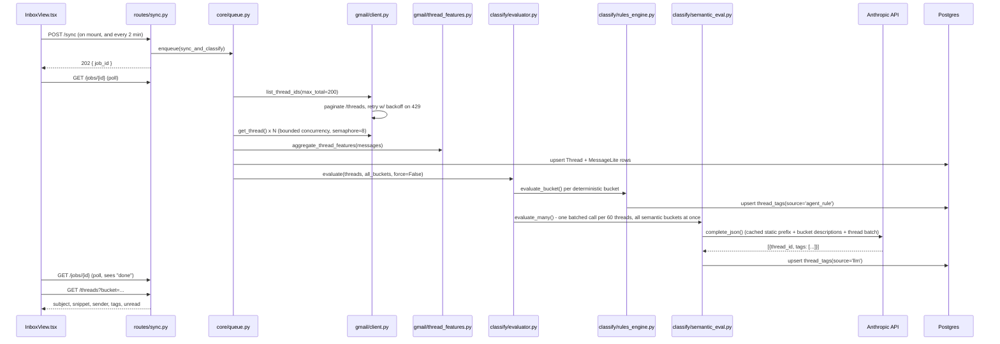
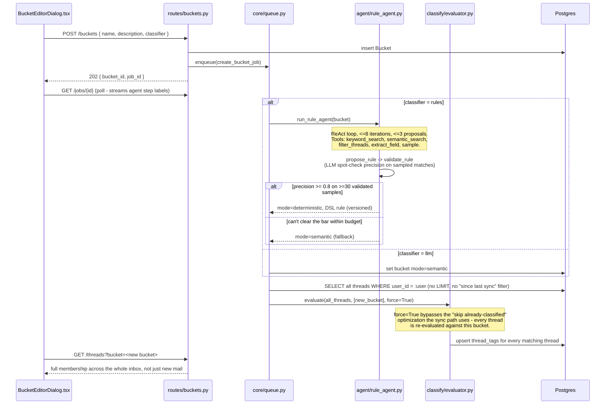
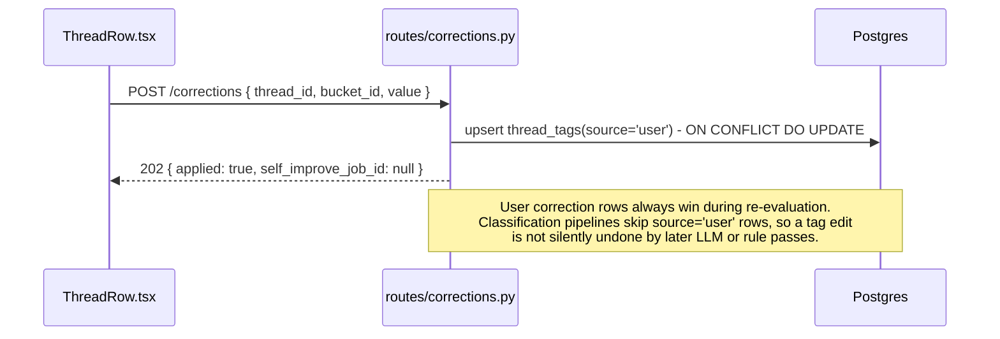

# Classification Pipeline

Everything reduces to one primitive: `evaluate(db, threads, buckets, force)` in
`api/classify/evaluator.py`. It splits the given buckets into `deterministic` and
`semantic`, runs the deterministic ones through the rules engine (free, in-process), and
batches all the semantic ones into shared LLM calls. `force` controls whether already-tagged
threads are skipped (`force=False`, the sync path) or unconditionally re-evaluated
(`force=True`, the bucket-create/edit path).

## On-load: sync + classify the last 200 threads

Notes:
- Deterministic default buckets (e.g. Newsletter, matched on `List-Unsubscribe` presence)
  become visible almost immediately since they cost no LLM call.
- If a semantic batch call fails (`LLMJSONError`/`LLMUnavailableError`),
  `semantic_eval.py` falls back to a Gmail-category→bucket-name mapping so the UI never
  shows an empty hole for that batch.
- `gmail/client.py` retries Gmail 429s / `rateLimitExceeded` up to 5 times with exponential
  backoff + jitter; `core/llm.py` does the same for Anthropic rate-limit/overload errors.

## Creating a custom bucket: recategorizes ALL existing threads

This is the path behind the assignment's "allow users to create their own buckets... which
should then recategorize all of the emails based on the new buckets."

The same `force=True`, all-threads pattern is reused for manual rule edits
(`PUT /buckets/{id}/rule`) and bucket mode/description changes (`PATCH /buckets/{id}`) —
any time a bucket's *definition* changes, its membership is recomputed against every thread
the user has. Existing buckets are deliberately **not** re-run when a new bucket is added —
only the new bucket's membership is (re)computed — which keeps the cost of adding a bucket
proportional to one bucket, not the whole taxonomy.

## User corrections are preserved as explicit overrides

