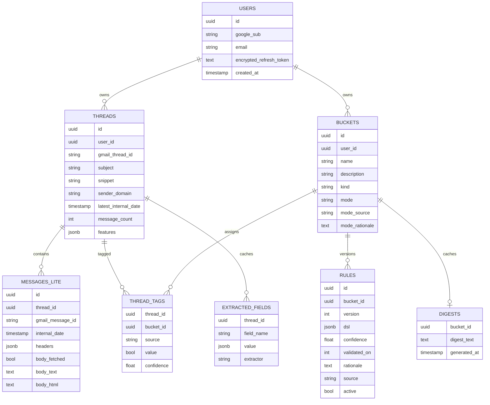

# Data Model

Ground truth is `api/core/models.py` (SQLAlchemy ORM) plus the Alembic migrations in
`api/migrations/versions/`. This reflects the schema as actually built.

Mermaid reserves some words in ER attributes, so the diagram uses `field_name` for the
actual `extracted_fields.field` column and `digest_text` for the actual `digests.text`
column.

## Invariants

- **`thread_tags` rows with `source='user'` are never overwritten by a pipeline.**
  `classify/rules_engine.py` and `classify/evaluator.py` explicitly skip threads with an
  existing user correction for a bucket when re-deriving `agent_rule`/`llm` tags.
- **Zero tags = generic inbox.** There's no sentinel "uncategorized" row — a thread with no
  `thread_tags` rows simply doesn't match any bucket. The frontend's "all" / unbucketed
  view is `NOT EXISTS (thread_tags for thread)`.
- **Re-evaluation deletes + re-derives `llm`/`agent_rule` rows** for the (thread, bucket)
  scope being evaluated; it never touches `user`-sourced rows.
- **Rule versions are append-only.** `rules.active` is the only mutable field on an
  existing row from the rollback path — a new rule proposal always inserts a new
  `(bucket_id, version)` row and deactivates the prior one, so history (and rollback) is
  preserved.
- **`extracted_fields` is a forever-cache**, keyed by `(thread_id, field)`: once a value is
  extracted (regex or LLM) for a thread, it's reused by any rule or agent tool call that
  needs it, never recomputed.
