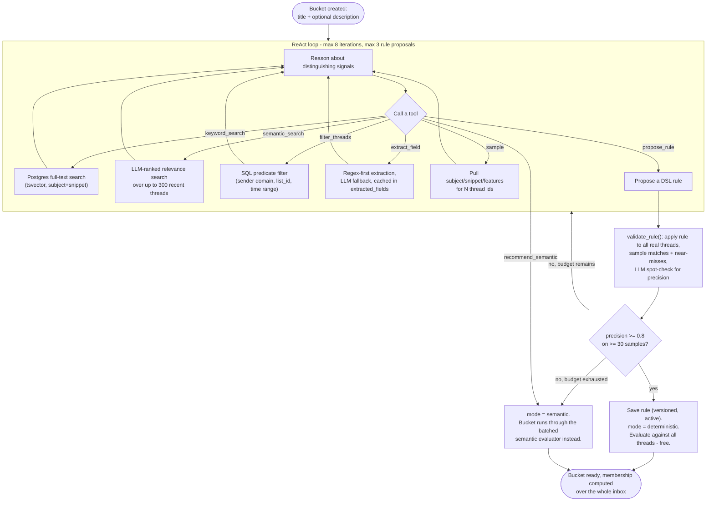

# The Rule Agent

`api/agent/rule_agent.py` is the most technically substantial piece of the system — a
cold-start agent that turns a user-supplied bucket name/description into either a free,
deterministic rule or an explicit decision to fall back to per-thread LLM judgment. It's the
mechanism behind requirement #5 (custom buckets) and the project's standout "wow" feature.

## Cold-start loop

Iteration and proposal budgets are hard caps (`MAX_ITERATIONS=8`, `MAX_PROPOSALS=3` in
`rule_agent.py`) — the agent always terminates in bounded time, either with a validated
rule or an explicit semantic fallback. Every step is streamed to the frontend via an
`on_step` callback (`core/queue.push_progress`), which `BucketEditorDialog.tsx` renders live
as "Agent is exploring…" progress.

## Design notes

- The agent's tools only ever query **our own Postgres data** (already-synced threads),
  never live Gmail — exploration is fast and free of additional Gmail quota.
- `semantic_search` is LLM-based ranking today, not embeddings. The interface is stable and
  the implementation is swappable; pgvector would be the likely production replacement.
- `extract_field` results are cached forever per `(thread_id, field)`, so the same
  extraction (e.g., "amount") computed once during agent validation is reused by any rule
  or subsequent agent run without a repeat LLM call.
